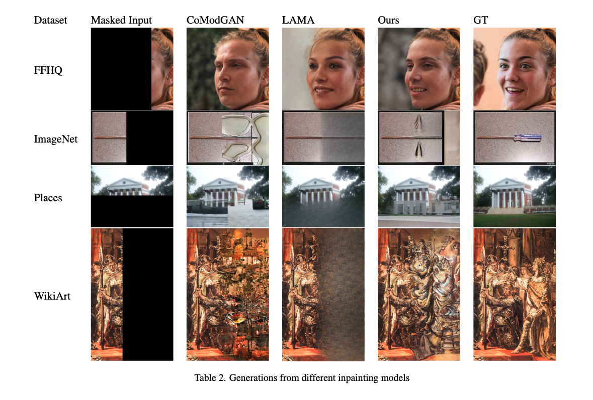
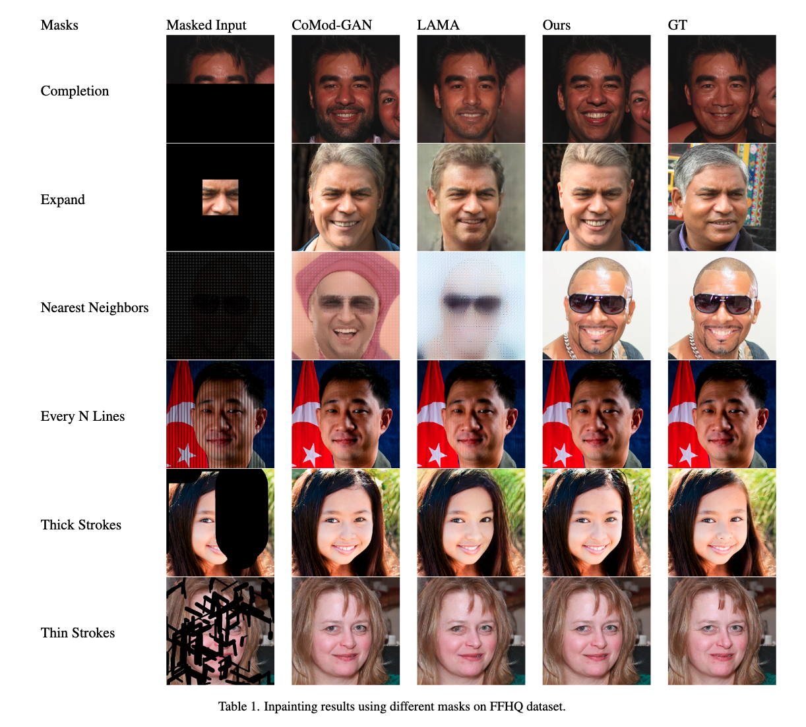

# Unsupervised Image Inpainting

This is the code accompanying our project on image inpainting done as part of the Final Project for Computer Vision Course (CSCI-GA 2271) at New York University.

## How to run

Each sub folder has a README to guide you to run the necessary code.

## Results

Our modified CoModGAN has the following results on ImageNet, WikiArt, Places and FFHQ dataset:

For different types of masks, the generated images look as follows on the FFHQ dataset:

## Acknowledgements
We would like to express our sincere gratitude to `Prof. Rob Fergus` for his invaluable guidance and support throughout the research process. His insights and expertise were invaluable in helping us to shape the direction of our work and achieve our goals. We also want to extend our thanks to the NYU HPC team for providing us with the resources and support we needed to complete our research. Their assistance was essential in helping us to successfully run our experiments and analyze our results.